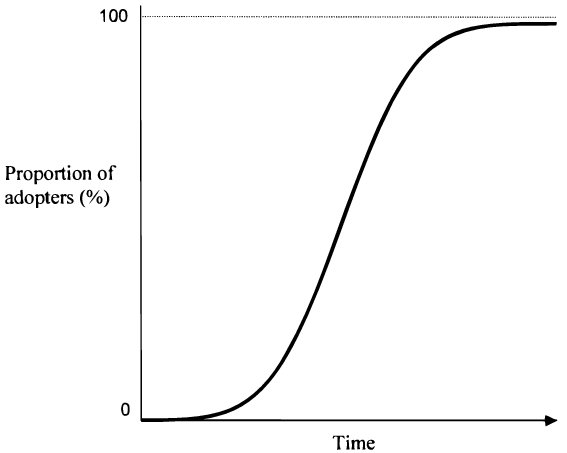
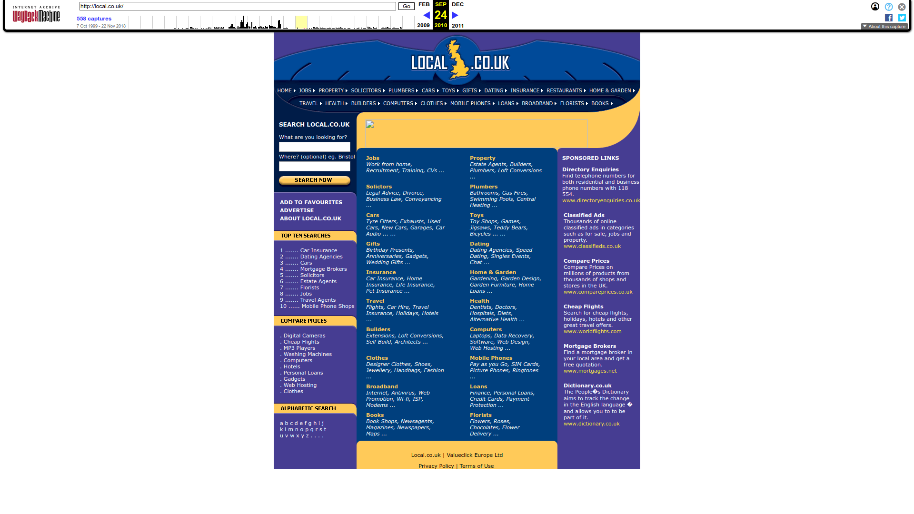

```{r, echo=FALSE, results=FALSE, include=FALSE}
library(knitr)
library(tidyverse)
library(rprojroot)
library(magick)
library(purrr)
library(kableExtra)

knitr::opts_chunk$set(echo = FALSE, message = F, warning = F) # By default, hide code; set to TRUE to see code
#knitr::opts_chunk$set(out.width = '100%', dpi=300) # Figure resolution and size

# This is the project path
path <- find_rstudio_root_file()
```

## Contents

::: {style="margin-left: 50px !important; text-align:left !important"}
-   Introduction

-   Web data

-   Methods

-   Results

    -   S-shaped diffusion curves
    -   Rank dynamics
    -   Exploratory spatial analysis
    -   Modelling

-   Conclusions <br> <br>
    <!-- [etranos.info/post/gceg2022](https://etranos.info/post/gceg2022/) -->
:::

# Introduction

## Aim

-   Diffusion of a new technology: the *web*
-   Geographers used to be interested in diffusion
-   @hagerstrand1968innovation
-   Passed the torch to economists and sociologists
-   Why? Lack of granular data:

> Because new digital activities are rarely---if ever---captured in
> official state data, researchers must rely on information gathered
> from alternative sources [@zook2022mapping].

## Importance

-   Guide policies for deployment of new technologies

-   Predictions of introduction times for future technologies
    [@meade2021modelling]:

    -   Network operators

    -   Suppliers of network equipment

    -   Regulatory authorities

## Technological diffusion

<br>



## *Spatial* diffusion processes

-   As in temporal diffusion models, an **S-shaped** pattern in the
    cumulative level of adoption

-   A **hierarchy effect**: from main centres to secondary ones --
    central places

-   A **neighborhood effect**: diffusion proceeds outwards from
    innovation centres, first "hitting" nearby rather than far-away
    locations [@grubler1990rise]

@hagerstrand1965monte: from innovative centres (core) through a
hierarchy of sub-centres, to the periphery

## Diffusion of a new *digital* technology

<br>

-   Diffusion of an **intangible**, digital technology [*web*]

-   Map the **active** engagement with the *digital*

-   Over time, **early stages** of the internet [*1996-2012*]

-   Granular and multi-scale **spatial processes**

# Web data

## Long story short

-   Data from the Internet Archive, the oldest web archive

-   Observe commercial websites 1996 - 2012 in the UK (*.co.uk*)

-   Geolocation: postcode references in the text

-   Timestamp: archival year

-   Counts

## Web data: The Internet Archive

{width="70%"}

## Web data: The Internet Archive

{width="70%"}

## Long story short

-   Data from a Web Archive -- The Internet Archive

-   Observe commercial websites 1996 - 2012 in the UK (*.co.uk*)

-   Geolocation: postcode references in the text

-   Timestamp: archival year

-   Counts

------------------------------------------------------------------------

```{r , eval=T, message=FALSE, out.width = "1200px"}
path.image <- paste0(path, "/presentations/images/past_publications.png")
knitr::include_graphics(path.image)
```

## Web data: The Internet Archive

-   The largest archive of webpages in the world
-   273 billion webpages from over 361 million websites, 15 petabytes of
    storage (1996 -)
-   A web crawler starts with a list of URLs (a seed list) to crawl and
    downloads a copy of their content
-   Using the hyperlinks included in the crawled URLs, new URLs are
    identified and crawled (snowball sampling)
-   Time-stamp

## Our web data

-   JISC UK Web Domain Dataset: all archived webpages from the .uk
    domain 1996-2012

-   Curated by the British Library

## Our web data

-   All .uk archived webpages which contain a UK postcode in the web
    text

-   Circa 0.5 billion URLs with valid UK postcodes

<br> <br>

<!-- <small></small> -->

20080509162138 \| <http://www.website1.co.uk/contact_us> \| IG8 8HD

## Data cleaning

-   All the archived .uk webpages

-   Archived during 1996-2012

-   Commercial webpages (.co.uk)

-   From webpages to websites:

    <small>- <http://www.website1.co.uk/webpage1> and</small>

    <small>- <http://www.website1.co.uk/webpage2> are part of
    the</small>

    <small>- <http://www.website1.co.uk></small>

-   1 *vs.* multuple postcodes in a website

## Unique postcodes frequencies, 2000

```{r eval=TRUE, echo=FALSE, results='asis'}

# load 2000 co.uk
# path.2000 <- "C:/Users/nw19521/OneDrive - University of Bristol/projects/archive/nuts/all2000couk.csv"
# path.2000 <- "/Users/nw19521/Library/CloudStorage/OneDrive-UniversityofBristol/projects/archive/nuts/all2000couk.csv"
path.2000 <- paste0(path, "/data/temp/all2000couk.csv")

all2000.duplicates <- data.table::fread(path.2000) #
# dim(all2000.duplicates) # 3336162
# it includes duplicated URLs: if one webpages includes multiple postcodes
# then it appears multiple times. This is ok for the nuts aggregation, but
# not for the frequencies
# This is only .co.uk

# one line for every host
all2000 <- unique(all2000.duplicates, by = c("host")) # 57897

# unique postcodes per website f table
f.websites.pc <- DescTools::Freq(all2000$V1, breaks = c(0, 1,2, 10,100,1000,10000,100000), ord = "desc")
f.websites.pc$level <- factor(f.websites.pc$level, levels = c("[0,1]","(1,2]", "(2,10]", "(10,100]",
                                                              "(100,1e+03]", "(1e+03,1e+04]",
                                                              "(1e+04,1e+05]"))
levels(f.websites.pc$level) <- c("(0,1]","(1,2]", "(2,10]", "(10,100]", "(100,1000]", "(1000,10000]", "(10000,100000]")
kable(f.websites.pc,
      format = "html",
      digits = 3,
      format.args = list(big.mark = ",")) %>% 
  kable_classic(full_width = F, html_font = "Cambria")
```

<br>

-   Websites with a large number of postcodes: e.g. directories, real
    estate websites

-   Focus on websites with **one unique** postcode per year

## Directory website with a lot of postcodes



## Website with a unique postcode in London


# Methods

## Reminder: diffusion mechanisms

-   **S-shaped** pattern in the cumulative level of adoption

-   A **hierarchy effect**: from main centres to secondary ones

-   A **neighborhood effect**: first "hitting" nearby locations

## Methods

-   Cumulative adoption: Self-starting logistic growth model [`nls` and
    `SSlogis`]

-   Descriptive statistics & ESDA

-   Machine learning framework [random forests]

-   Two scales:

    -   websites per firm in a Local Authority
    -   websites in an Output Area

# S-shaped diffusion curves

------------------------------------------------------------------------

```{r UK S, eval=T, out.width = "60%", out.height="60%"}

path.image <- paste0(path, "/outputs/s/s_uk_per_firm.png")
knitr::include_graphics(path.image)
```

```{r LA_S_gif, eval=F, results='asis', out.width = "60%"}
path.images <- paste0(path, "/outputs/s/s_lad_per_firm/")

library(magick)
las <- list.files(path = path.images, pattern = "^lad_", full.names = T) 
las <- sample(las, 50)
las_list <- lapply(las, image_read)

## join the images together
las_joined <- image_join(las_list)

## animate at 2 frames per second
las_animated <- image_animate(las_joined, fps = 4)

## view animated image
#las_animated

## save to disk
# image_write(image = las_animated,
#             path = "las.gif")
image_write_gif(las_animated, path = "las.gif")

  # map(image_read) %>% # reads each path file
  # image_join() %>% # joins image
  # image_animate(delay=50) #%>% # animates, can opt for number of loops
  #image_write("test.gif") # write to current dir
```

------------------------------------------------------------------------

```{r gif S, eval=T, out.width = "60%", out.height="60%"}
#, fig.height=5, fig.width=5, message=FALSE, out.width = "60%"

path.image <- paste0(path, "/presentations/las.gif")
knitr::include_graphics(path.image)
```

------------------------------------------------------------------------

```{r Xmid_frequency_graph, eval=T, fig.height=5, fig.width=5, message=FALSE, out.width = "60%"}
path.image <- paste0(path, "/outputs/s/xmid_f.png")
knitr::include_graphics(path.image)
```

------------------------------------------------------------------------

```{r diffusion_speed_map, fig.height=5, fig.width=5, message=FALSE, out.width = "100%"}
path.image <- paste0(path, "/outputs/s/speed_map.png")
knitr::include_graphics(path.image)
```

------------------------------------------------------------------------

```{r Reading, eval=T, fig.height=5, fig.width=5, message=FALSE, out.width = "60%"}
path.image <- paste0(path, "/outputs/s/s_lad_per_firm/lad_E06000038.png")
knitr::include_graphics(path.image)
```

------------------------------------------------------------------------

```{r City_of_London, eval=T, fig.height=5, fig.width=5, message=FALSE, out.width = "60%"}
path.image <- paste0(path, "/outputs/s/s_lad_per_firm/lad_E09000001.png")
knitr::include_graphics(path.image)
```

------------------------------------------------------------------------

<!-- slow -->

```{r Middlesbrough, eval=T, fig.height=5, fig.width=5, message=FALSE, out.width = "60%"}
path.image <- paste0(path, "/outputs/s/s_lad_per_firm/lad_E06000002.png")
knitr::include_graphics(path.image)
```

------------------------------------------------------------------------

```{r Bristol, eval=T, fig.height=5, fig.width=5, message=FALSE, out.width = "60%"}
path.image <- paste0(path, "/outputs/s/s_lad_per_firm/lad_E06000023.png")
knitr::include_graphics(path.image)
```

------------------------------------------------------------------------

```{r Hackney, eval=T, fig.height=5, fig.width=5, message=FALSE, out.width = "60%"}
path.image <- paste0(path, "/outputs/s/s_lad_per_firm/lad_E09000012.png")
knitr::include_graphics(path.image)
```

## Diffusion speed

<br>

-   Spatial heterogeneity

-   Not a clear, easy to explain pattern

# Rank dynamics: stability vs. volatility

------------------------------------------------------------------------

<br>

-   Adoption heterogeneity

-   Different perceptions of risk and economic returns from new
    technologies

-   Early adopters vs. laggards, leapfrogging

------------------------------------------------------------------------

```{r , eval=T, fig.height=5, fig.width=5, message=FALSE}
path.image <- paste0(path, "/outputs/ranks/web_per_firm2000_2012_only0595_av.png")
knitr::include_graphics(path.image)
```

## Rank dynamics and diffusion speed

-   Spatial heterogeneity

-   Expected volatility

# Spatial mechanisms

------------------------------------------------------------------------

> **Neighbourhood effect**: diffusion proceeds outwards from innovation
> centers, first "hitting" nearby rather than far-away locations
> [@grubler1990rise]

-   Spatial dependency (Moran's I & LISA maps)

-   Websites per firm in Local authorities (c. 400)

-   Websites in Output Areas (c. 230,000)

------------------------------------------------------------------------

```{r moransi, results='asis'}
path.in.la <- paste0(path, "/outputs/lisa/corrected/LA/morani_la.csv")
path.in.oa <- paste0(path, "/outputs/lisa/corrected/oa/morani_oa.csv")

la.m <- read_csv(path.in.la) %>% 
  filter(p < 0.001) %>% # all values were significant
  mutate(spatial.unit = 'LAD')
oa.m <- read_csv(path.in.oa) %>% 
  filter(p < 0.001) %>% # all values were significant
  mutate(spatial.unit = 'OA')

bind_rows(la.m, oa.m) %>% 
  ggplot(aes(x=year, y=morani, fill= spatial.unit)) +
  geom_bar(stat = 'identity', position = 'dodge') +
  ylab('Moran\'s I') +
  theme_minimal() +
  theme(plot.title = element_text(hjust = 0.5), 
        axis.text.x = element_text(angle = 90, vjust = 0.5, hjust=1)) +
  scale_fill_manual('Spatial unit', 
                    values = c("LAD" = "grey80",
                                "OA"="grey48"),
                     limits = force) +
  scale_x_continuous(NULL, labels = as.character(1996:2012), breaks = 1996:2012) +
  theme(legend.position="bottom",
        text = element_text(size = 12),
        legend.text=element_text(size=12),
        legend.title=element_text(size=12),
        axis.title=element_text(size=12),
        axis.text.x = element_text(angle = 0, vjust = 0.5, hjust=1))
```


------------------------------------------------------------------------

```{r lisa_la, results='asis', out.width = "60%"}
path.images <- paste0(path, "/outputs/lisa/corrected/la/")

list.files(path = path.images, pattern = "^lisa_level_pc1_la", full.names = T)[-c(1,2)] %>%
  map(image_read) %>% # reads each path file
  image_join() %>% # joins image
  image_animate(delay=50) #%>% # animates, can opt for number of loops
  #image_write("test.gif") # write to current dir
```

------------------------------------------------------------------------

```{r lisa_oa, eval=T,results='asis', out.width = "60%"}
path.images <- paste0(path, "/outputs/lisa/corrected/oa/")

list.files(path = path.images, pattern = "^lisa_level_pc1_oa", full.names = T) %>% 
  map(image_read) %>% # reads each path file
  image_join() %>% # joins image
  image_animate(delay=50) #%>% # animates, can opt for number of loops
  #image_write("test.gif") # write to current dir
```

## Neighbourhood effect

-   Spatial dependency
    -   Relatively small, consistent over time / scales
    -   London hot spot early on
    -   At local scale, consistent hotspots over time
    -   Granular analysis reveals other hotspots
        <!-- -   Distance effect -->
        <!--     -   Urban gravitation increases over time and then drops -->
        <!--     -   Granular analysis: gravitation -->
        <!--     -   Lost explanatory power over time -->

------------------------------------------------------------------------

<br>

> **Hierarchy effect**: from main centers to secondary ones -- central
> places

-   Gini coefficient

------------------------------------------------------------------------

```{r gini, results='asis'}
path.in.la <- paste0(path, "/outputs/gini/gini_la.csv")
path.in.oa <- paste0(path, "/outputs/gini/gini_oa.csv")

la.gini <- read_csv(path.in.la) %>% 
  mutate(spatial.unit = 'LAD')
oa.gini <- read_csv(path.in.oa) %>% 
  mutate(spatial.unit = 'OA')

bind_rows(la.gini, oa.gini) %>%
  rename(Gini = 'gini(a$n)') %>% 
  ggplot(aes(x=year, y=Gini, fill= spatial.unit)) +
  geom_bar(stat = 'identity', position = 'dodge') +
  ylab('Gini') +
  theme_minimal() +
  theme(plot.title = element_text(hjust = 0.5), 
        axis.text.x = element_text(angle = 90, vjust = 0.5, hjust=1)) +
  scale_fill_manual('Spatial unit', 
                    values = c("LAD" = "grey80",
                                "OA"="grey48"),
                     limits = force) +
  scale_x_continuous(NULL, labels = as.character(1996:2012), breaks = 1996:2012) +
  theme(legend.position="bottom",
        text = element_text(size = 12),
        legend.text=element_text(size=12),
        legend.title=element_text(size=12),
        axis.title=element_text(size=12),
        axis.text.x = element_text(angle = 0, vjust = 0.5, hjust=1))
```

## Hieararchy

-   Almost perfect polarisation of web adoption in the early stages at a
    granular level

-   Polarisation decreases over time

-   More equally diffused at the Local Authority level

# Putting all of these together

## Modelling framework

-   [A hierarchy effect: from main centres to secondary
    ones]{style="color:orange;"}

-   [A neighborhood effect: first "hitting" nearby
    locations]{style="color:olive;"}

-   [S-shaped pattern in the cumulative level of
    adoption]{style="color:violet;"}

<br> <small>
$$Website\,Density_{t} \sim \color{orange}{Distance\,London} + 
\color{orange}{Website\,density\,London_{t-1}} + \\
\color{orange}{Distance\,Nearest\,City} + 
\color{orange}{Website\,density\,Nearest\,City_{t-1}} + \\
\color{orange}{Distance\,Nearest\,Retail_{i}} +
\color{orange}{Website\,density\,Nearest\,Retail_{t-1}} +\\
\color{olive}{W*\, Website\,density_{t-1}} +\\ 
\color{violet}{year_{t}}$$ </small>

## Modelling framework

-   Random forests to predict $Website\,Density_{i,t}$

-   2 spatial resolutions:

    -   Local Authorities (websites per firm)
    -   Output Areas (websites)

-   2 sets of models:

    -   All the data ⟹ *variable importance*
    -   Train on all but one region, test on the holdout region ⟹
        *spatial differences and similarities* of diffusion mechanisms

-   Space-time sensitive 10-fold CV (`CAST`)

## Models trained on all data

<br>

|                    | RMSE  | $R^{2}$   | MAE   |
|--------------------|-------|-----------|-------|
| Local Authorities\*| 0.028 | 0.850     | 0.019 |
| Output Areas       | 3.284 | 0.320     | 1.034 |

<small> \*No retail centre predictors for the Local Authority models
</small>

## Variable importance 

```{r varimp, eval = T, out.height= "58%", out.width="58%", message=FALSE}
path.importance.lad <- paste0(path, "/outputs/rf/figures/varimp_LA_corrected.csv")
path.importance.oa <- paste0(path, "/outputs/rf/figures/varimp_OA_corrected.csv")

importance.oa <- read_csv(path.importance.oa) %>% 
  mutate(id = c("LD", "NC", "NR", "STL", "Y", "DL", "DNC", "DNR")) %>% 
  mutate(variable = str_to_sentence(variable))
importance.lad <- read_csv(path.importance.lad) %>% 
  mutate(id = c("LD", "NC", "STL", "Y", "DL", "DNC")) %>% 
  mutate(variable = str_to_sentence(variable))


importance.oa %>% 
  rename(OA = importance) %>% 
  left_join(importance.lad %>% rename(LAD = importance), by = "id") %>%
  dplyr::select(-variable.y, -id) %>% 
  rename(variable = variable.x) %>% 
  pivot_longer(!variable, names_to = "spatial.unit", values_to = "importance") %>% 
  mutate(order = ifelse(variable == "Distance to london", 1,
                        ifelse(variable == "London's wensite density, t-1", 2,
                               ifelse(variable == "Distance to the nearest city", 3,
                                      ifelse(variable == "Nearest city's wensite density, t-1", 4,
                                             ifelse(variable == "Distance to the nearest retail centre", 5,
                                                    ifelse(variable == "Nearest retail centre's wensite density, t-1", 6,
                                                           ifelse(variable == "Spatial and temporal lag of wensite density", 7, 8)))))))) %>% 
  ggplot(aes(x=importance, y=reorder(variable, desc(order)), #forcats::fct_reorder(variable, importance), 
         fill = spatial.unit)) +
  geom_col(position = 'dodge') +
  ylab('') +
  theme_minimal() +
  theme(plot.title = element_text(hjust = 0.5), 
        axis.text.x = element_text(vjust = 0.5, hjust=1)) +
  scale_fill_manual('Spatial unit: ', 
                    values = c("LAD" = "grey80",
                                "OA"="grey48"),
                     limits = force) +
  scale_x_continuous('Variable importance') +
  theme(legend.position="bottom",
        text = element_text(size = 14),
        legend.text=element_text(size=14),
        legend.title=element_text(size=14),
        axis.title=element_text(size=14))
```

## Regional similarities

```{r similarity, eval = T, message=FALSE}
path.lad <- paste0(path, "/outputs/rf/figures/test_regions_LA_corrected.csv")
path.oa <- paste0(path, "/outputs/rf/figures/test_regions_OA_corrected.csv")

lad <- read.csv(path.lad) %>% 
  rename('RSquared LAD' = Rsquared)

oa <- read.csv(path.oa) %>% rename(Region = test.region,
                                   'RSquared OA' = Rsquared)

lad %>% left_join(oa) %>% 
  mutate('Rank OA' = rank(desc(`RSquared OA`)),
         'Rank LAD' = rank(desc(`RSquared LAD`))) %>% 
  relocate(5, .after = 2) %>% 
  arrange(`Rank LAD`) %>% 
  kable(digits=3)
```

<!-- ## Alternative specification: growth, trained on all data -->

<!-- <br> <small> -->
<!-- $$Website\,Density\,Growth_{t} \sim \color{orange}{Distance\,London} +  -->
<!-- \color{orange}{Website\,density\,London_{t-1}} + \\ -->
<!-- \color{orange}{Distance\,Nearest\,City} +  -->
<!-- \color{orange}{Website\,density\,Nearest\,City_{t-1}} + \\ -->
<!-- \color{orange}{Distance\,Nearest\,Retail_{i}} + -->
<!-- \color{orange}{Website\,density\,Nearest\,Retail_{t-1}} +\\ -->
<!-- \color{olive}{W*\, Website\,density_{t-1}} +\\  -->
<!-- \color{violet}{year_{t}}$$ </small> -->

<!-- <br> -->

<!-- |                     | RMSE  | RSquared | MAE   | -->
<!-- |---------------------|-------|----------|-------| -->
<!-- | Local Authorities\* | 0.200 | 0.634    | 0.148 | -->

<!-- <small> \*No retail centre predictors for the Local Authority models -->
<!-- </small> -->

<!-- ## Alternative specification: growth, trained on all data -->

<!-- ```{r growth LA} -->
<!-- path.table <- paste0(path, "/outputs/rf/figures/test_regions_LA_growth.csv") -->
<!-- read.csv(path.table) %>%  -->
<!--   mutate(Rsquared = round(Rsquared, digits= 3)) %>%  -->
<!--   arrange(desc(Rsquared)) %>%  -->
<!--   kable() -->
<!-- ``` -->

# Conclusions

------------------------------------------------------------------------

-   Established technological diffusion spatial processes still apply

    -   for a digital technology
    -   at local scales

-   Geography matters: spatial dependency, urban gravitation

-   Hierarchical diffusion

-   Granular analysis reveals patterns otherwise not visible

-   Stability and volatility: leapfrogging, early adopters dropping, but
    also stable positions

-   Spatially consistent mechanisms at local scale

-   Regional heterogeneity


## References {.allowframebreaks}
